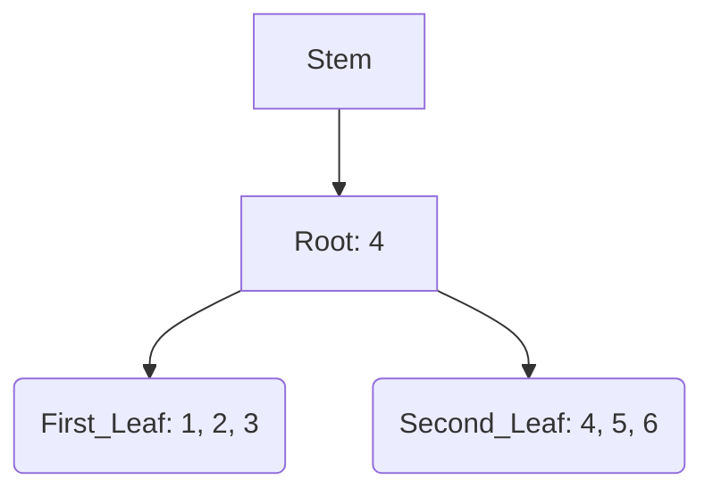
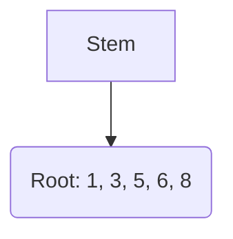

# B+Tree Base
This is advanced **c++** implementation of [B+Tree](https://en.wikipedia.org/wiki/B%2B_tree) data structure. 

This _implementation_ allows you to inject your own custom code between different stages of execution tree commands using predefined **hooks**.

Is is expected that you would extend the "Base" classes and take control over the predefined hooks.

For some examples look at the **Advanced Usage** section.

## Table of contest
* [Description](#btree-base)
* [Build](#build)
* [Basic Usage Classes](#basic-usage-classes)
	* [class BPlusTreeBase<class Key, class T>](#class-bplustreebaseclass-key-class-t)
		* [Aliases:](#aliases)
		* [BPlusTreeBase(int factor)](#bplustreebaseint-factor)
		* [long long int size()](#long-long-int-size)
		* [void insert(std::pair<Key, T> item, bool overwrite = false)](#void-insertstdpairkey-t-item-bool-overwrite--false)
		* [void erase(Key key)](#void-erasekey-key)
		* [void erase(iterator it)](#void-eraseiterator-it)
		* [void clear()](#void-clear)
		* [iterator find(Key key)](#iterator-findkey-key)
		* [iterator begin()](#iterator-begin)
		* [iterator end()](#iterator-end)
		* [iterator lower_bound(Key key)](#iterator-lower_boundkey-key)
		* [iterator upper_bound(Key key)](#iterator-upper_boundkey-key)
		* [T& operator[](Key key)](#t-operatorkey-key)
	* [class BPlusTreeIterator<class Key, class T>](#class-bplustreeiteratorclass-key-class-t)
		* [Aliases](#aliases-1)
		* [iterator& operator++()](#iterator-operator)
		* [iterator operator++(int)](#iterator-operatorint)
		* [iterator& operator–()](#iterator-operator--)
		* [iterator operator–(int)](#iterator-operator--int)
		* [entry_item& operator*()](#entry_item-operator)
		* [entry_item operator->()](#entry_item-operator-)
		* [const Key& get_key()](#const-key-get_key)
		* [T& get_value()](#t-get_value)
		* [bool expired()](#bool-expired)
* [Basic Usage Example](#basic-usage-example)
* [Advanced Usage Classes](#advanced-usage-classes)
	* [class BPlusTreeBaseInternalNode<class Key, class T> : BPlusTreeBaseNode<class Key, class T>](#class-bplustreebaseinternalnodeclass-key-class-t--bplustreebasenodeclass-key-class-t)
	* [class BPlusTreeBaseLeafNode<class Key, class T> : BPlusTreeBaseNode<class Key, class T>](#class-bplustreebaseleafnodeclass-key-class-t--bplustreebasenodeclass-key-class-t)
	* [BPlusTree<class Key, class T> protected hook methods](#bplustreeclass-key-class-t-protected-hook-methods)
		* [void processSearchNodeStart(node_ptr node, PROCESS_TYPE type)](#void-processsearchnodestartnode_ptr-node-process_type-type)
		* [void processSearchNodeEnd(node_ptr node, PROCESS_TYPE type)](#void-processsearchnodeendnode_ptr-node-process_type-type)
		* [void processInsertNode(node_ptr node)](#void-processinsertnodenode_ptr-node)
		* [void processDeleteNode(node_ptr node)](#void-processdeletenodenode_ptr-node)
		* [void processLeafInsertItem(node_ptr node, childs_item_ptr item)](#void-processleafinsertitemnode_ptr-node-childs_item_ptr-item)
		* [void processLeafDeleteItem(node_ptr node, childs_item_ptr item)](#void-processleafdeleteitemnode_ptr-node-childs_item_ptr-item)
		* [void processLeafSplit(node_ptr node, node_ptr new_node, node_ptr link_node)](#void-processleafsplitnode_ptr-node-node_ptr-new_node-node_ptr-link_node)
		* [void processLeafJoin(node_ptr node, node_ptr join_node, node_ptr link_node)](#void-processleafjoinnode_ptr-node-node_ptr-join_node-node_ptr-link_node)
		* [void processLeafShift(node_ptr node, node_ptr shift_node)](#void-processleafshiftnode_ptr-node-node_ptr-shift_node)
		* [void processLeafLock(node_ptr node)](#void-processleaflocknode_ptr-node)
		* [void processLeafFree(node_ptr node)](#void-processleaffreenode_ptr-node)
		* [void processItemMove(node_ptr node, childs_item_ptr item)](#void-processitemmovenode_ptr-node-childs_item_ptr-item)
		* [void processLeafRef(node_ptr node, node_ptr ref_node, LEAF_REF ref)](#void-processleafrefnode_ptr-node-node_ptr-ref_node-leaf_ref-ref)
		* [void processLeafReserve(node_ptr node, PROCESS_TYPE type)](#void-processleafreservenode_ptr-node-process_type-type)
		* [void processLeafRelease(node_ptr node, PROCESS_TYPE type)](#void-processleafreleasenode_ptr-node-process_type-type)
		* [void processOffsetLeafReserve(node_ptr node, int offset)](#void-processoffsetleafreservenode_ptr-node-int-offset)
		* [void processOffsetLeafRelease(node_ptr node, int offset)](#void-processoffsetleafreleasenode_ptr-node-int-offset)
		* [void processItemReserve(childs_item_ptr item, PROCESS_TYPE type)](#void-processitemreservechilds_item_ptr-item-process_type-type)
		* [void processItemRelease(childs_item_ptr item, PROCESS_TYPE type)](#void-processitemreleasechilds_item_ptr-item-process_type-type)
		* [void processIteratorMoveStart(childs_type_iterator item, int step)](#void-processiteratormovestartchilds_type_iterator-item-int-step)
		* [void processIteratorMoveEnd(childs_type_iterator item, int step)](#void-processiteratormoveendchilds_type_iterator-item-int-step)
* [Advanced Usage Example](#advanced-usage-example)
* [Additional Information](#additional-information)
	* [My Pleasure](#my-pleasure)
	* [TODOs](#todos)
	* [License](#license)

## Build
Library was tested using **GNU G++** compiler with flag **-std=c++14**. So it is recommended to use C++ 14 or higher version of compiler. Compiling with another compilers might need code corrections.

## Basic Usage Classes

### class BPlusTreeBase<class Key, class T>
Base class for creating structure

#### Aliases:
* BPlusTreeBase<typename Key, typename T>::**value_type** = std::pair<Key, T>
* BPlusTreeBase<typename Key, typename T>::**iterator** = BPlusTreeIterator<Key, T>

For simplification we will use the shorter form (just **value_type**) in the next sections.

#### BPlusTreeBase(int factor)
Basic constructor. Requires one `int` parameter to be passed that represents minimal size of non root tree nodes.

#### long long int size()
Returns number of elements inside the tree.

#### void insert(std::pair<Key, T> item, bool overwrite = false)
Insert element to the tree with key as `item.first` and value as `item.second`. This method allows you to provide additional parameter to determine whenever you want to overwrite previous value. If `overwrite` is set to `false` (by default `false`), if the value with the same key exists in the tree, new value will not overwrite previous one.

#### void erase(Key key)
Removes item with specific key from the tree. Requires one parameter to be passed and returns nothing. **Complexity:** _Log(n)_

#### void erase(iterator it)
Removes item from tree the same as method above, but instead of `Key` it requires `iterator` for the element you want to delete to be provided as first argument. **Complexity:** _Log(n)_

#### void clear()
Removes all items from tree.

#### iterator find(Key key)
Finds item with specific key and return `iterator` for the item. If no item found with specific key, it returns **end** `iteraotr`. Similar to the `std` data structures. **Complexity:** Log(n)

#### iterator begin()
Returns `iterator` pointing to the first element in the tree. If there is no elements in the tree, returns **end** `iterator`. **Complexity:** Log(n)

#### iterator end()
Returns **end** `iterator`

#### iterator lower_bound(Key key)
Returns an iterator pointing to the first element in the container whose key is not considered to go before _key_ (i.e., either it is equivalent or goes after). **Complexity:** Log(n)

#### iterator upper_bound(Key key)
has the same behavior as `lower_bound`, except in the case that the tree contains an element with a key equivalent to _key_: In this case, `lower_bound` returns an `iterator` pointing to that element, whereas `upper_bound` returns an `iterator` pointing to the next element. **Complexity:** Log(n)

#### T& operator[](Key key)
returns value of item with provided key. If no item with specific key exists in the tree, item will be created.

___

### class BPlusTreeIterator<class Key, class T>
Iterator class used to travel along the tree. There is also alias for the iterator through the tree class: **BPlusTreeBase<Key, T>::iterator**.

#### Aliases
BPlusTreeIterator<class Key, class T>::**entry_item** = std::pair<const Key&, T>

#### iterator& operator++()
Operator of prefix increment **(++it)** Moves current iterator pointer to the next item. Returns itself. If no next item found, become **end** iterator.

***Example:***
```c++
BPlusTreeBase<int, int> tree(50);
tree.insert(make_pair(5,6));
tree.insert(make_pair(1,2));

BPlusTreeBase<int,int>::iterator it = tree.begin();
++it;

cout << (*it).first << endl; // 5
```

#### iterator operator++(int)
Operator of suffix increment **(it++)** Moves current iterator pointer to the next item, but return previous iterator. If no next item found, become **end** iterator.

#### iterator& operator--()
Operator of prefix decrement **(--it)** Moves current iterator pointer to the previous item. Returns itself. If no previous item found, become **end** iterator.

#### iterator operator--(int)
Operator of suffix decrement **(it--)** Moves current iterator pointer to the previous item, but returns next previous iterator _(behaviour similar to int--)_. If not previous item found, become **end** iterator.

#### entry_item& operator*()
**Dereferencing** operator. Used to get access to the current item **key** and **value** similar how **std::map** iterator::operator*() works.

#### entry_item operator->()
Used to get access to the pointer of current item pair. 

***Example:***
```c++
BPlusTreeBase<int, int> tree(50);
tree.insert(make_pair(5,6));
tree.insert(make_pair(1,2));

BPlusTreeBase<int,int>::iterator it = tree.begin();
cout << "Key: " << (it->first) << "; Value: " << (it->second) << endl; // Key: 1; Value: 2
```

#### const Key& get_key()
Returns _const reference_ to the current iterator item key.

#### T& get_value()
Returns _reference_ to the current iterator item value.

#### bool expired()
Checks whenever iterator is referencing to the correct value. In cases when you removed item to which pointing iterator, this method will return false as iterator was corrupted and accessing its values could cause undefined behaviour.

## Basic Usage Example
You could use this data structure as simple _generic_ data structure similar to `std::map`

***Example:***
```c++
BPlusTreeBase<int, string> tree(50);
tree.insert(make_pair(15, "Freaking"));
tree.insert(make_pair(18, "World!"));
tree.insert(make_pair(10, "Hello"));

tree.erase(15);

std::cout << tree[10] + " " + tree[18] << std::endl; // Hello World!

auto it = tree.begin();

it->second = "Guten Tag";
++it;
it->second = "Welt!";

for(auto& it : tree){
	cout << it.second << " ";
}
// Guten Tag Welt!

```

## Advanced Usage Classes

Main difference between default **std** containers and this BPlusTreeBase container that current implementation allows you to extend the classes and inject your own code and logic to the code execution!

Here we will go through the additional classes and methods allowed to be extended and implemented for your own unique case. And in the next section there will be couple of useful examples of how you can apply it.

### class BPlusTreeBaseInternalNode<class Key, class T> : BPlusTreeBaseNode<class Key, class T>

Class used internally in **BPlusTreeBase** class. It accepts the same generic parameters as main class. It is used to provide logic for the **intermediate** nodes that tie all leaf node's values.

### class BPlusTreeBaseLeafNode<class Key, class T> : BPlusTreeBaseNode<class Key, class T>

Class used internally in **BPlusTreeBase** class. It accepts the same generic parameters as main class. It is used to provide logic for the **final** nodes that contains all the items in the tree. Basically pointers to those nodes located in the **iterators**.

___

### BPlusTree<class Key, class T> protected hook methods
Those hooks allows you to inject your code to the internal execution processes.

Lets introduce some additional **aliases** and **enum classes**:
* BPlusTree<class Key, class T>::**Node** = BPlusTreeBaseNode<class Key, class T>
* BPlusTree<class Key, class T>::**node_ptr** = std::shared_ptr\<Node\>
* BPlusTree<class Key, class T>::**PROCESS_TYPE** = enum class { READ, WRITE }
* BPlusTree<class Key, class T>::**LEAF_REF** = enum class { PREV, NEXT }
* BPlusTree<class Key, class T>::**child_item_ptr** = std::shared_ptr\<BPlusTreeBaseNode<Key, T>::child_item_type\>

Hooks methods follows

#### void processSearchNodeStart(node_ptr node, PROCESS_TYPE type)
This method called every time before each *Node* is accessed. For example consider there is a **tree** initialised with **factor** of **3** and it contains 6 elements from 1 to 6. For simplification consider only keys here, so the internal node structure looks something like:



**Notice:** _There is always one additional **InternalNode** called **stem**_

Lets say **find(5)** command called: first of all **processSearchNodeStart** will be called for **stem** node, then for **root** node (4) and the for the node containing the key we consider to find **(Second Leaf)**. Second parameter for all methods will be equal to **PROCESS_TYPE::READ** as there will not be any changes applied to the tree.

#### void processSearchNodeEnd(node_ptr node, PROCESS_TYPE type)
Method called every time when node is no longer needed. Lets consider the same example as above


And the same `find(5)` method called, then the order of methods calls will looks like: 
1. processSearchNodeStart(stem, READ)
2. processSearchNodeStart(root, READ)
3. **processSearchNodeEnd(stem, READ)**
4. processSearchNodeStart(Second_Leaf, READ)
5. **processSearchNodeEnd(root, READ)**
6. **processSearchNodeEnd(Second_Leaf, READ)**

So before _"ending"_ previous node, next node will be _"entered"_. The reason of such behaviour will be explained in the further sections.

#### void processInsertNode(node_ptr node)
Method calls each time when node content was changed and its current state needs to be _"saved"_. This method will be called for the nodes after inserting or deleting new element(s). Also this method will be called for the newly created nodes. 

***Example:*** tree with factor of 3

Lets see for the hooks that will be called after inserting new element with **key = 4**

1. processSearchNodeStart(Stem, WRITE)
2. processSearchNodeStart(Root, WRITE)
	_Here after inserting new element to the **Root** node, this node will split and new node will be created. And also new **Root** node will be created_
3. processSearchNodeStart(Second_Leaf, WRITE) <-- newly created leaf node
4. **processInsertNode(Second_Leaf)**
5. **processInsertNode(First_Leaf)** <-- Root node that split and become First_Leaf
6. processSearchNodeEnd(Second_Leaf, WRITE)
7. processSearchNodeEnd(First_Leaf, WRITE)
8. processSearchNodeStart(Root, WRITE) <-- newly created Root node
9. **processInsertNode(Root)**
10. processSearchNodeEnd(Root, WRITE)
11. processSearchNodeEnd(Stem, WRITE)

And so the structure become:


**Notice:** _All Start/End hooks was called with **WRITE** second parameter as `insert` method consider to change the tree_

#### void processDeleteNode(node_ptr node)
Method calls only when the node is going to be remove (and potentially destructed) from the tree. It is called between the **processSearchNodeStart** and **processSearchNodeEnd** hooks. There is only 2 public methods in **BPlusTreeBase** that could cause this method to be called: `erase` and `clear`. 

#### void processLeafInsertItem(node_ptr node, childs_item_ptr item)
This hook calls every time when `insert` method called. Hook called for the node after **processSearchNodeStart** and before **processInsertNode**. Second parameter represents data structure of inserted item. It contains next attributes:
* std::weak_ptr\<Node\> **node** - node linked to the item.
* std::shared_ptr\<record_type\> **item** - the actual item containing _key_ and _value_

**record_type** is another alias of **std::pair<const Key&, T>**

**Note:** _This method requires you to reserve this **item node** as **ItemRelease** hooks will be called for the item to release the node_

**Note:** _This method requires you to **lock** the **Leaf node** and the **item**_

#### void processLeafDeleteItem(node_ptr node, childs_item_ptr item)
This hook calls every time when `erase` method called. Hook called for the node from which the **item** will be removed. parameters similar to the **processLeafInsertItem**

**Note:** _This method requires you to reserve this **item node** as **ItemRelease** hooks will be called for the item to release the node_

**Note:** _This method requires you to **lock** the **Leaf node** and the **item**_

#### void processLeafSplit(node_ptr node, node_ptr new_node, node_ptr link_node)
This hook calls when internal node _split_ its elements to **2** separate nodes. It accepts Actual node that going to lose elements as **node**, newly created node that accepts elements from node - **new_node**, and node that going to be changed by setting up `prev_node` or `next_node` linkage (and _"saved"_ with processInsertNode) because new_node needs to be linked to the chain of the leaf nodes - **link_node**
Method called after **processLeafInsertItem** and before **processInsertNode**

**Note:** _This method requires you to **lock** all of the **Leaf nodes** as **LeafFree** will be called for each of them separately.

#### void processLeafJoin(node_ptr node, node_ptr join_node, node_ptr link_node)
This hook calls when internal node _join_ another node elements after which this _other node_ is going to be removed from the tree _(and processDeleteNode will be called on it)_.
Similarly to **processLeafSplit** this method receives node that going to accept elements from _join_node_ - **node**, node that gives all its elements and going to be removed from the tree - **join_node** and similarly to previous hook, node that going to be changed by setting up leaf node chaining. Method called after **processLeafDeleteItem** and before **processInsetNode** or **processDeleteNode**

**Note:** _This method requires you to **lock** all of the **Leaf nodes** as **LeafFree** will be called for each of them separately.

#### void processLeafShift(node_ptr node, node_ptr shift_node)
This hook calls when internal node _shifts_ (accepts one item from another node). It happens on `erase` method called. This method receives node that going to accept one element - **node**, and the node that going to give one element - **shift_node**. Notice, no _link_node_ passed as no node is going to be added or deleted. Method called after **processLeafDeleteItem** and before **processInsertNode** hooks.

**Note:** _This method requires you to **lock** all of the **Leaf nodes** as **LeafFree** will be called for each of them separately.

#### void processLeafLock(node_ptr node)
This hook called for **Leaf** node that _must_ not be changed from another thread, if you're using multithreading. There is couple of hooks that _requires_ you to **lock** **Leaf** node from modifying from another threads. 

**Note:** _There is a notice on every such hook :P_

#### void processLeafFree(node_ptr node)
Hook that called when **Leaf** node _must_ be **unlocked** and could be modified from another threads. 

#### void processItemMove(node_ptr node, childs_item_ptr item)
This hooks calls for the item that moved from one node to another _(Or newly created item to the node)_ And the method requires **you** to assign the **node** to the **item->node**. (currently everything this method do is actually this assignment `item->node = node_weak(node);` , but you can also apply your own weird logic here on your own risk ofc :P)

#### void processLeafRef(node_ptr node, node_ptr ref_node, LEAF_REF ref)
This hook calls for the **Leaf** node that needs to update its reference node _(previous or next node reference)_. It accepts **node** that needs to update its reference, **ref_node** is the node that needs to be linked, and the **ref** pointe what reference _(previous or next)_ needs to be updated. Likewise the previous hook, **you** must update it by yourself (and that is exactly what this methods do originally, but you can also apply your own logic here as well).

#### void processLeafReserve(node_ptr node, PROCESS_TYPE type)
Hooks calls for the **Leaf** node that needs to be reserved. Reserved node memory should not be released before **release** hook called. Moreover, if **reserve** was called couple of times for one node, the same time of **release** hooks will be called, and you should not free memory for the node until "count" of reserve/release hooks equals 0.

**Note:** _couple of other hooks will require you to reserve node. Every hooks that need to required node will have notice in its description. I know everything sounds pretty complicated, and some of the hooks might looks weird and unneeded, but everything. Maybe it does :D But if you want to dig deep to the structure, you can find every hooks useful and meaningful..._

#### void processLeafRelease(node_ptr node, PROCESS_TYPE type)
Hook that notify you to release the **Leaf** node. 

#### void processOffsetLeafReserve(node_ptr node, int offset)
The same as **processLeafReserve** but reservation should be done for the node that is shifted by some **offset** number. You can get to the new node using `node->next_leaf()` or `node->prev_leaf()`.

**Note:** _The number could be equal to **0**, **1** or **-1**._

#### void processOffsetLeafRelease(node_ptr node, int offset)
The same as **processLeafRelease** but release should be done for the node that is shifted by some **offset** number. You can get to the new node using `node->next_leaf()` or `node->prev_leaf()`.

**Note:** _The number could be equal to **0**, **1** or **-1**._

#### void processItemReserve(childs_item_ptr item, PROCESS_TYPE type)
Likewise the **LeafRelease** this hook notify you that item _(And its node)_ should be reserved in the same way **LeafReserve** do.

#### void processItemRelease(childs_item_ptr item, PROCESS_TYPE type)
Hook that notify you to release the **item** and its **node**.

#### void processIteratorMoveStart(childs_type_iterator item, int step)
Hook called right before the iterator pointer moves forward or back. **step** parameter define the number of items you should go for. This value could be negative, which means that the pointer moves to the previous item.

**Note:** _the value of **step** could be either **1** or **-1**._

#### void processIteratorMoveEnd(childs_type_iterator item, int step)
Hook called right after the iterator pointer already moved to the new item. **step** parameter defines the number of items it went for. This value could be negative which means that pointer moved to the previous item.

**Note:** _the value of **step** could be either **1** or **-1**._

## Advanced Usage Example
This example shows how to extend the classes to protect the container from **race conditions** and make the structure threading safe for _insert/delete_ operations.

```c++
template<class Key, class T>
class MyInternal : public BPlusTreeBaseInternalNode<Key, T> {
	public: 
		std::mutex my_mutex;
};

template<class Key, class T>
class MyLeaf : public BPlusTreeBaseLeafNode<Key, T> {
	public: 
		std::mutex my_mutex;
};

template<class Key, class T>
class MyIterator : public BPlusTreeBaseIterator<Key, T> {
	using BPlusTreeBaseIterator<Key, T>::BPlusTreeBaseIterator;
};

template<class Key, class T>
class MyBPT : public BPlusTreeBase<Key, T, MyInternal<Key, T>, MyLeaf<Key, T>, MyIterator<Key, T> >{
	public:
		typedef typename BPlusTreeBase<Key,T>::node_ptr node_ptr;
		typedef typename BPlusTreeBase<Key,T>::PROCESS_TYPE PROCESS_TYPE;
		MyBPT(int c) : BPlusTreeBase<Key, T, MyInternal<Key, T>, MyLeaf<Key, T>, MyIterator<Key, T> >(c){};
		
	protected:
		void processSearchNodeStart(node_ptr node, PROCESS_TYPE type){ 
			if(node->is_leaf()){
				auto rnode = std::static_pointer_cast<MyLeaf<Key, T> >(node);
				rnode->my_mutex.lock();
			} else {
				auto rnode = std::static_pointer_cast<MyInternal<Key, T> >(node);
				rnode->my_mutex.lock();
			}
		};
		void processSearchNodeEnd(node_ptr node, PROCESS_TYPE type){ 
			if(node->is_leaf()){
				auto rnode = std::static_pointer_cast<MyLeaf<Key, T> >(node);
				rnode->my_mutex.unlock();
			} else {
				auto rnode = std::static_pointer_cast<MyInternal<Key, T> >(node);
				rnode->my_mutex.unlock();
			}
		};
};
```

Now **MyBPT** Now using _insert/erase_ methods in multiple threads are completely **safe**!

***Example:***
```c++
MyBPT<int,int> tree(10);
int tc = 100;
int cnt = 10000;
vector<thread> trds;

for(int i=0;i<tc;i++){
	thread t([&cnt,&tree,&tc](int i){
		while(i<cnt){
			tree.insert(make_pair(i,i));
			i+=tc;
		}
	}, i);
	trds.push_back(move(t));
}

for(auto &t : trds){
	t.join();
}
```

## Additional Information

### My Pleasure
For most people basic usage will be enough, but for those who want to ~~struggle in agony like a freak~~ build your own complicated application based on **B+Tree** structure, you will find _Advanced Usage_ pretty useful for you! 

But you should consider that you may need to dig deep into the code, and this code might be pretty complicated _(like any balanced tree but anyway, acknowledge means prepared!)_

And feel free to leave comments or contact me if you need some help with understanding hooks or internal code.

### TODOs
There is couple of thinks I think would be great to implement, but I'm to lazy to spend time on it right now. But I leave it here just in case anybody would want to contribute :P

* Reverse Iterators
* Const Iterators
* Optimize **InternalNode** to use more convenient structure for holding other nodes then just a _std::vector_
* **BPlusTreeBase::insert** to return pair of **bool/iterator** (like std::map do)
* Implement `+=`/`-=` iterator operators
* Allocator template item
* Compare function (for some sake final order)

### License
MIT

Have fun :)
